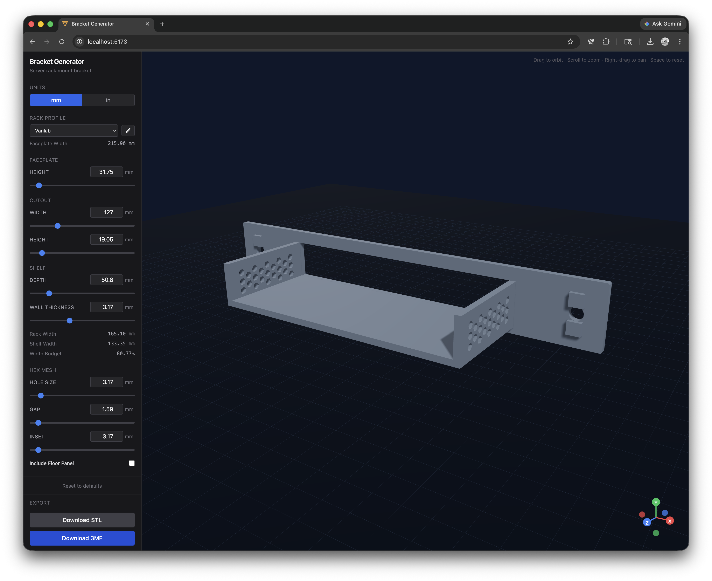

# Bracket Generator



A 3D bracket generator tool built with React, Three.js, and TypeScript. This application allows users to design and visualize custom brackets with various parameters.

## Features

- Interactive 3D bracket visualization
- Configurable bracket parameters (width, height, depth, hole positions)
- Real-time preview of bracket designs
- Export functionality for 3D models (STL/3MF formats)
- Responsive web interface with Tailwind CSS styling

## Technical Stack

- **Frontend**: React 18, TypeScript 5.x
- **3D Rendering**: Three.js with @react-three/fiber and @react-three/drei
- **State Management**: Zustand
- **Data Validation**: Zod schemas
- **Build Tool**: Vite
- **Styling**: Tailwind CSS
- **Unit Conversion**: Custom mm/in conversion utilities

## Getting Started

### Prerequisites

- Node.js v18+
- pnpm package manager

### Installation

1. Clone the repository
2. Install dependencies:
   ```bash
   pnpm install
   ```

### Development

Start the development server:
```bash
pnpm dev
```

The application will be available at `http://localhost:5173`

### Building

Create a production build:
```bash
pnpm build
```

### Testing

Run tests:
```bash
pnpm test
```

## Project Structure

```
src/
├── components/    # React UI components
├── geometry/      # 3D geometry builders
├── models/        # Zod schemas and TypeScript types
├── store/         # Zustand app state
├── units/         # Unit conversion utilities
├── export/        # STL and 3MF serializers
└── pages/         # Top-level views
```

## Usage

1. Adjust the bracket parameters using the control panel
2. View the 3D model in real-time
3. Fine-tune the design by modifying parameters
4. Export your bracket design in STL or 3MF format

## Contributing

1. Fork the repository
2. Create a feature branch
3. Make your changes
4. Submit a pull request

## License

This project is licensed under the MIT License - see the LICENSE file for details.

## Acknowledgments

- Built with React and Three.js
- Uses Zustand for state management
- Developed with TypeScript for type safety